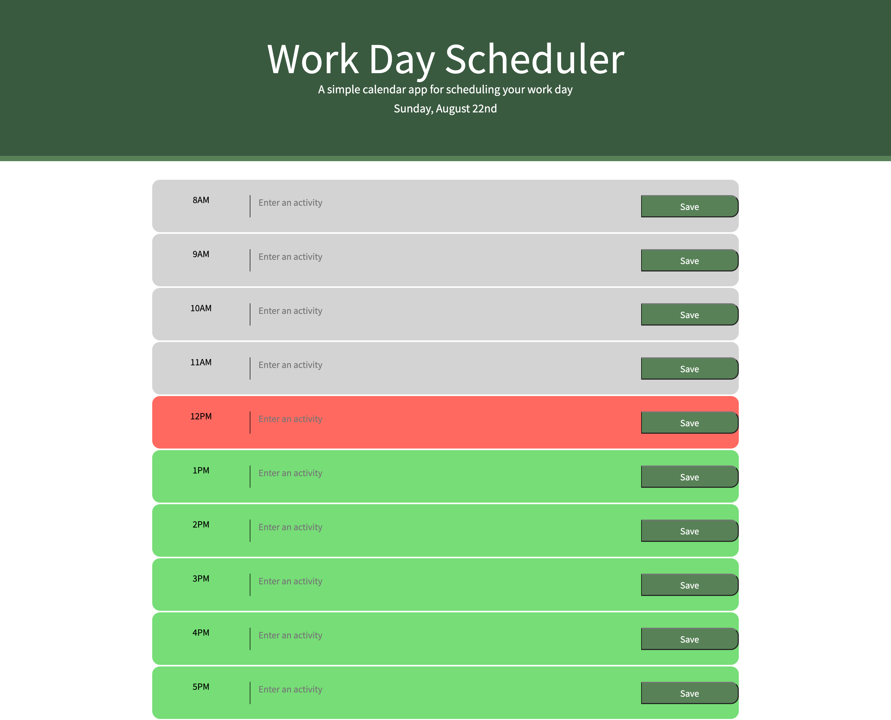
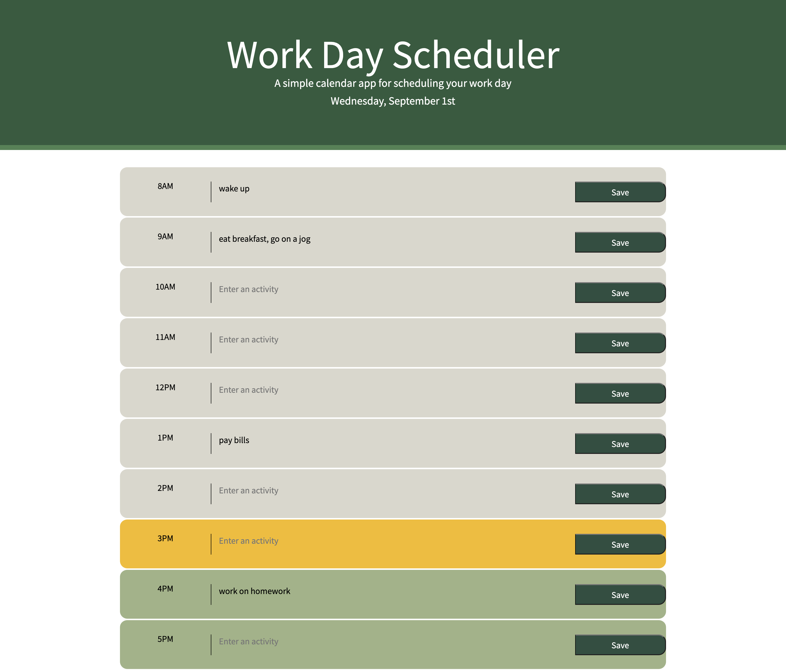

# my-daily-planner

## Description
This application, My Daily Planner, was created with the purpose of helping the user keep track of their schedule within one day and display time in the past as greyed out, the current hour as red, and future hours left in the work day as green. The daily planner also shows today's day and date, so the user knows what day they're logging activities for.

I enjoyed this project but am having a difficult time transitioning from vanilla JavaScript into JQuery, so I'll need to continue studying to learn how to shorten my JavaScript code!

## Installation
For installation and deployment, please [click here](https://candiceywu.github.io/my-daily-planner/). The application should launch with all windows prompts active. 

## Technologies and languages used
HTML, CSS, Bootstrap, JavaScript, jQuery and Moment.js were utilized for this application.

## Usage
The user can store their work day's activities in this daily planner. The user can enter an activity and click the 'save' button so that the activity will be saved into local storage. If the user refreshes or closes the tab, and re-loads the page, the activities will still show up so the user doesn't lose their notes of planned activities for that day. The following images show the web application's appearance, and if the user refreshes the page it will still show previous entries (second image):

## License & Copyright

(c) Candice Wu 

contact: candice.ying.wu@gmail.com 

Licensed under the MIT License [click here](license).